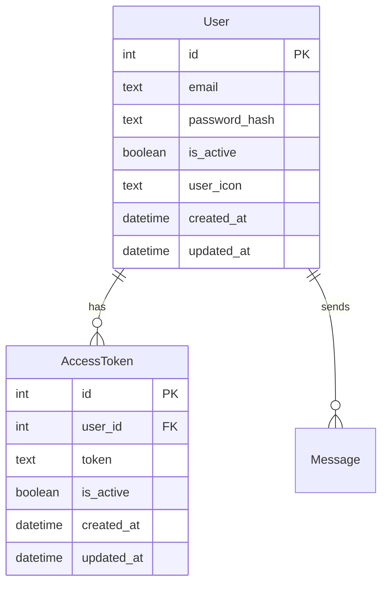

# electron-react-todos

## 開発環境起動

```bash
npm run build
npm run dev
```

## sqlite db

### 環境構築

```bash
npm i sqlite3\nnpm i -D @types/sqlite3\nnpm i sqlite
```

```bash
npm install @prisma/client
npm install prisma --save-dev
```

#### クライアントの生成

```bash
npx prisma init
# npx prisma generate
npm run prisma:generate
```

- 確認
  package.json

```json
{
  "type": "module"
  // ... 他の設定
}
```

### db 内容確認

```bash
sqlite3 db.sqlite
```

```bash
.tables
```

```bash
.schema users
```

```bash
SELECT * FROM users;
SELECT * FROM user_sessions;
```

```bash
.exit
```


